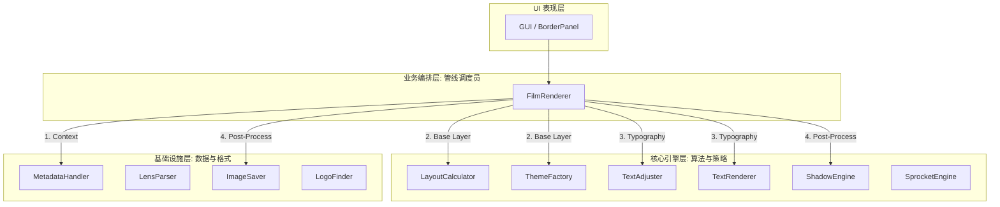

# GT23 Workflow 架构说明文档 (v2.4.2)

本文档旨在阐明 GT23 Workflow 在 v2.4.2 版本深度瘦身后，基于“管线化 (Pipelining)”和“组件化 (Componentization)”的模块化分层架构。

---

## 1. 总体分层架构图

---

## 2. 各层级详细职责

### 2.1 UI 表现层 (Presentation Layer)
*   **代表组件**：`gui/panels/` (如 `BorderPanel.py`)
*   **职责**：负责用户交互、参数收集。它不感知具体的渲染逻辑，只通过 `data` 字典传递配置。

### 2.2 业务编排层 (Orchestration Layer)
*   **代表组件**：`core/renderer.py` (`FilmRenderer` 类)
*   **职责**：作为渲染管线的“指挥官”，将复杂的渲染逻辑拆分为四个标准化阶段：
    1.  **_prepare_context**：调用 `MetadataHandler` 补全信息，调用 `LensParser` 格式化标题。
    2.  **_draw_base_layer**：计算几何布局，生成主题背景画布。
    3.  **_apply_typography**：调用 `TextAdjuster` 进行字体缩放与碰撞检测，驱动 `TextRenderer` 绘制。
    4.  **_finalize_output**：执行后期特效（阴影、打平）与文件 IO。

### 2.3 核心引擎层 (Domain Engine Layer)
*   **布局引擎 (`LayoutCalculator`)**：计算图片、边框、文字的绝对像素坐标。
*   **主题工厂 (`ThemeFactory`)**：返回具体的主题对象。`Theme` 接口现在承接了 **自适应颜色检测** 逻辑。
*   **排版调节器 (`TextAdjuster`)**：**[New v2.4.2]** 负责字体自适应缩放计算，并执行 **物理碰撞检测**（防止文字压图）。
*   **文字渲染引擎 (`TextRenderer`)**：负责渲染高层排版，处理图标间距与品牌标识绘制。
*   **美学特效引擎 (`ShadowEngine`)**：实现高级多层悬浮投影。

### 2.4 基础设施层 (Infrastructure Layer)
*   **元数据处理 (`MetadataHandler`)**：**[Enhanced]** 承接了 `Make/Model` 的自动识别补全逻辑。
*   **品牌识别 (`LensParser`)**：**[Enhanced]** 承接了主标题去重、品牌特定字符串格式化（如哈苏处理）逻辑。
*   **输入输出 (`ImageSaver` / `ExifEditor`)**：负责图像保存与 EXIF 数据恢复。

---

## 3. 架构优势

1.  **极致瘦身**：`FilmRenderer` 核心逻辑从最初的 900+ 行精简至目前的 **约 260 行**，核心入口方法仅 40 行。
2.  **零感知扩展**：新增主题或修改亮度检测算法，只需在 `Theme` 类或 `TextAdjuster` 中修改，主渲染管线无需变动。
3.  **逻辑内聚**：文字相关的坐标判断由 `TextAdjuster` 负责，元数据相关的补全由 `MetadataHandler` 负责，彻底解决了单体类过度膨胀问题。

---
*Document Version: v2.4.2 (2026-05-16)*
