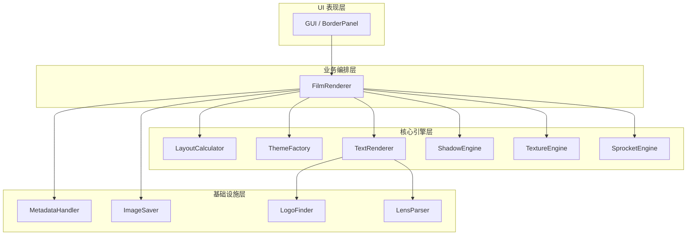

# GT23 Workflow 架构说明文档 (v2.4.1)

本文档旨在阐明 GT23 Workflow 在 v2.4.1 版本重构后的模块化分层架构。通过将原本臃肿的单体渲染器解耦，系统现在遵循“职责单一、高内聚低耦合”的设计原则。

---

## 1. 总体分层架构图

---

## 2. 各层级详细职责

### 2.1 UI 表现层 (Presentation Layer)
*   **代表组件**：`gui/panels/` (如 `BorderPanel.py`)
*   **职责**：负责用户交互、参数收集与实时预览请求。它不感知具体的渲染逻辑，只通过参数字典 (data dict) 与下一层通信。

### 2.2 业务编排层 (Orchestration Layer)
*   **代表组件**：`core/renderer.py` (`FilmRenderer` 类)
*   **职责**：作为整个渲染流水线的“指挥官”。
    *   **数据整合**：调用 `MetadataHandler` 补全图片 EXIF 信息。
    *   **流程控制**：依次驱动布局计算、主题实例化、画布生成、照片绘制、文字渲染和最终保存。
    *   **异常处理**：捕获渲染过程中的错误并返回降级方案。

### 2.3 核心引擎层 (Domain Engine Layer)
这是 v2.4.1 重构的核心，将复杂的算法拆分为独立的专业引擎：

*   **布局引擎 (`LayoutCalculator`)**：
    *   纯数学计算模块。根据图片长宽比、边框预设和文字大小，计算出所有组件的绝对像素坐标。
*   **主题工厂 (`ThemeFactory`)**：
    *   采用 **工厂模式**。根据主题名称（如 `frosted`, `rainbow`）返回具体的 `Theme` 对象。
    *   `Theme` 类负责定义配色方案 (`get_colors`) 和背景画布生成 (`create_canvas`)。
*   **文字渲染引擎 (`TextRenderer`)**：
    *   负责高层排版逻辑。包含 Logo 智能着色、SVG/PNG 字体切换、以及复杂的文字/Logo 间距协调。
*   **美学特效引擎 (`ShadowEngine` / `TextureEngine`)**：
    *   **Shadow**：负责实现从简单的弥散阴影到复杂的“多层悬浮投影”算法。
    *   **Texture**：负责生成哑光磨砂颗粒感，增强画面高级感。
*   **齿孔引擎 (`SprocketEngine`)**：
    *   专门负责 135/120 胶片齿孔的物理模拟绘制。

### 2.4 基础设施层 (Infrastructure Layer)
*   **元数据处理 (`MetadataHandler`)**：负责读写 EXIF/XMP 信息。
*   **品牌识别 (`LogoFinder` / `LensParser`)**：通过关键词匹配相机品牌 Logo 路径，解析镜头型号字符串。
*   **输入输出 (`ImageSaver` / `ExifEditor`)**：负责图像的最终平整化 (Flatten)、颜色配置嵌入及文件保存。

---

## 3. 重构后的核心优势

1.  **极易扩展**：如果你想增加一个“复古报纸”主题，只需在 `core/theme/` 下新增一个类并在工厂注册，无需改动 `renderer.py`。
2.  **逻辑解耦**：阴影算法的改进（如调整模糊半径）只在 `ShadowEngine` 中修改，不会影响到文字排版或布局计算。
3.  **性能可控**：每个模块都可以独立进行耗时统计 (Timings)，方便精准定位渲染瓶颈。
4.  **结构清晰**：`FilmRenderer` 从 900 多行精简至 300 行以内，大大降低了维护者的心智负担。

---
*Document Version: v2.4.1 (2026-05-16)*
