# GT23 Film Workflow (v2.3.0)

### [English] | [中文]

**GT23 Film Workflow** is a professional automation suite designed for film photographers. It bridges the gap between analog scans and digital presentation by simulating physical film aesthetic logic, restoring shooting metadata (EXIF) onto glowing "DataBacks", and generating industrial-grade contact sheets.

**GT23 Film Workflow** 是一款专为胶片摄影师打造的专业自动化工具。它旨在打破扫描件与数字展示之间的隔阂：通过模拟真实的物理底片排版逻辑，将拍摄元数据（EXIF）以“数码背印”形式还原至画面，并提供工业级的底片索引（Contact Sheet）生成能力。

---

## 🔥 Featured in v2.3.x | 新特性

### 🎞️ 135HF Half-Frame Specialization | 135 半格专题
- **P/L Layouts**: Supports native vertical (9x8) and horizontal (12x6) half-frame orientations.
- **Fixed 72-Slot Grid**: Fills missing frames with film-base colors for a professional full-sheet aesthetic.
- **双向排版**：针对半格相机的构图优化，支持 9*8(P) 或 12*6(L) 的逻辑布局。
- **强制 72 画幅补全**：不足的部分自动以底片基色填充，保持索引印样的完整视觉。

### 🌈 Artistic Themes | 艺术边框相纸
- **Rainbow & Macaron**: Narrative-driven sequential coloring for social media grids.
- **Dark Border**: Professional cold-midnight aesthetic for cinematic presentation.
- **彩虹与马卡龙**：为社交媒体九宫格设计的叙事性色彩分配方案。
- **深色模式**：高对比度的冷色调排版，赋予照片工业电影质感。

---

## 🖼️ GUI Preview | 界面预览

<table>
  <tr>
    <td align="center">
      <strong>Border Tool | 边框工具</strong> 
      
    </td>
    <td align="center">
      <strong>Contact Sheet | 底片索引</strong> 
      
    </td>
  </tr>
</table>

---

## 🚀 Key Features | 核心功能

* **Dual Toolsets | 双重工具集**: 
    * **Border Tool**: Professional processing for individual scans. Real-time preview, EXIF visibility toggle, and customizable border ratio. | **边框美化工具**: 为单张扫描件提供专业的裁剪、填充及美化。支持实时预览、EXIF 显隐控制。
    * **Contact Sheet (135/120/135HF)**: Automated index sheet generation with physical film simulation. | **底片索引工具**: 自动化生成具备物理底片质感的印像页。现已全面支持半格。

* **Dynamic DataBack | 动态背印**:
    * EN: Automatically reads EXIF (Date, Aperture, Shutter, Film stock) for each frame. Simulated glowing orange LED fonts. | CN: 自动读取每一帧的拍摄参数，采用仿真 LED 橙色数码管字体呈现背景标印。

* **Hand-Extracted Museum of Logos | 手工图标博物馆**:
    - EN: A massive expansion to **121+ logos**. Meticulously traced from **original vintage documentation** (Mamiya, Rollei, Contax, etc.) to capture the soul of each brand.
    - CN: **核心价值**：跨越式更新至 121+ 款。每一格图标都来自**相机原始时代的纸质说明书与宣传册**，手工勾勒，留住每一份工业设计灵魂。

  

<b>Click to view 13-page Gallery / 点击展开查看 13 页图标全画册</b>

  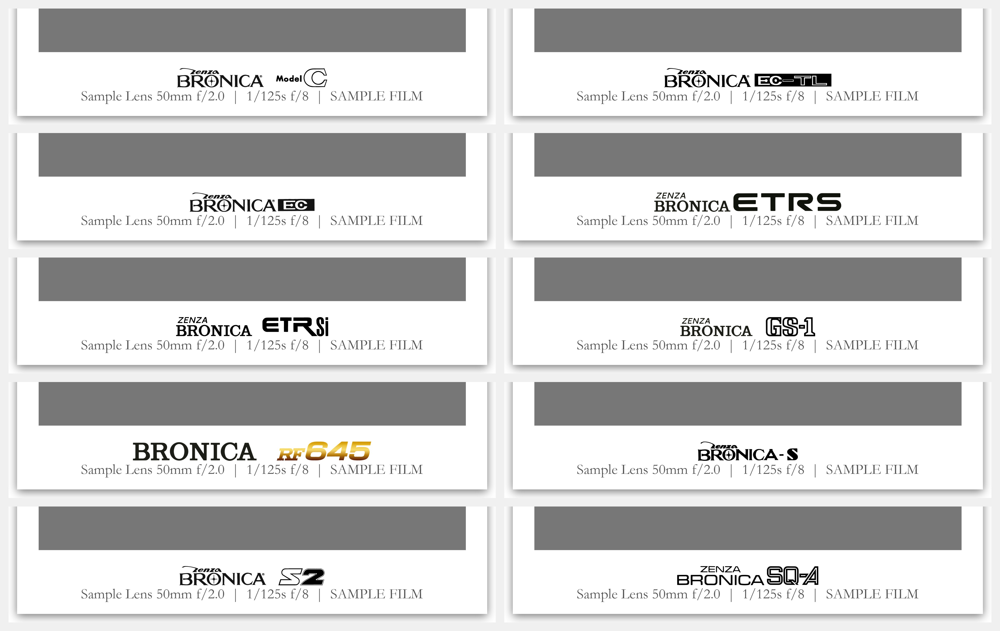 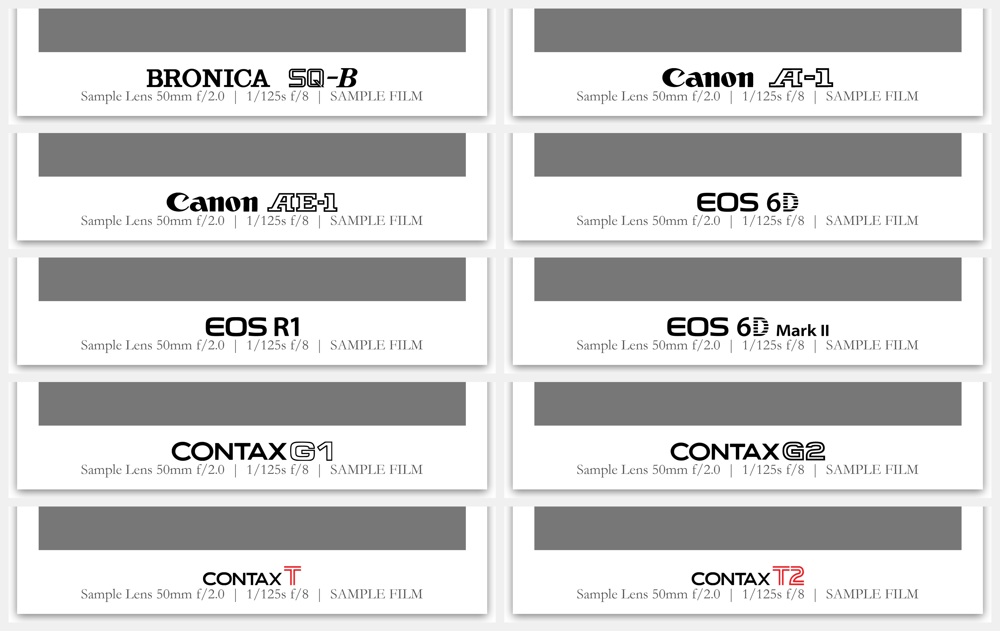
  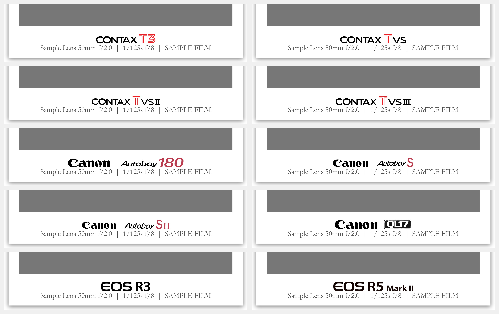 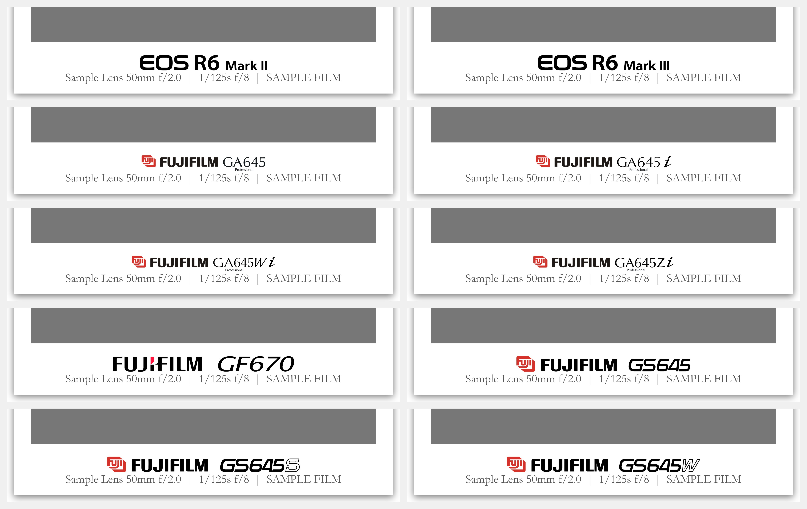
  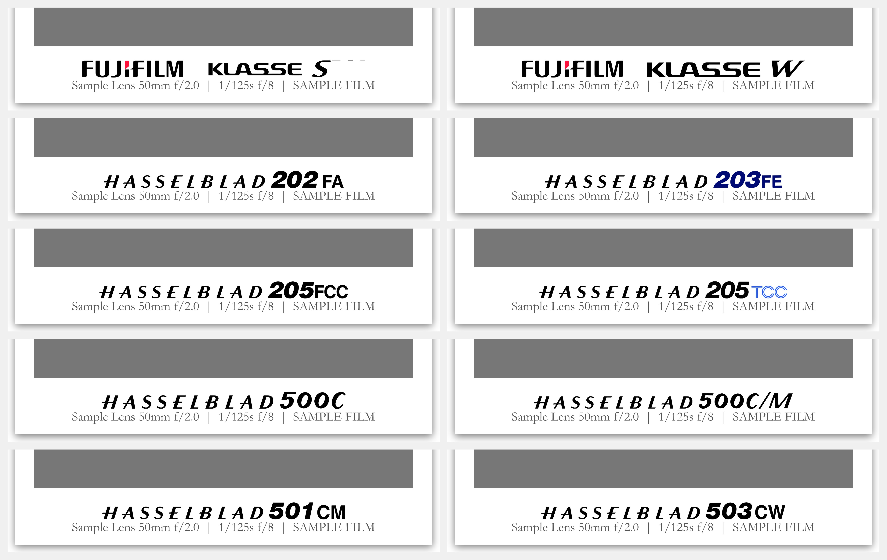 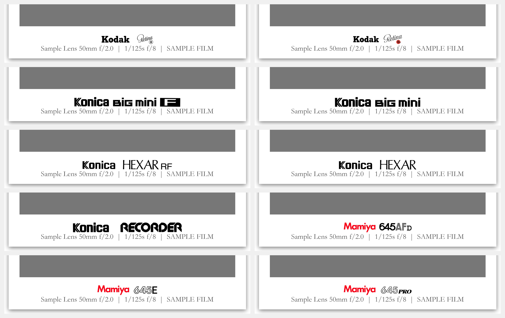
  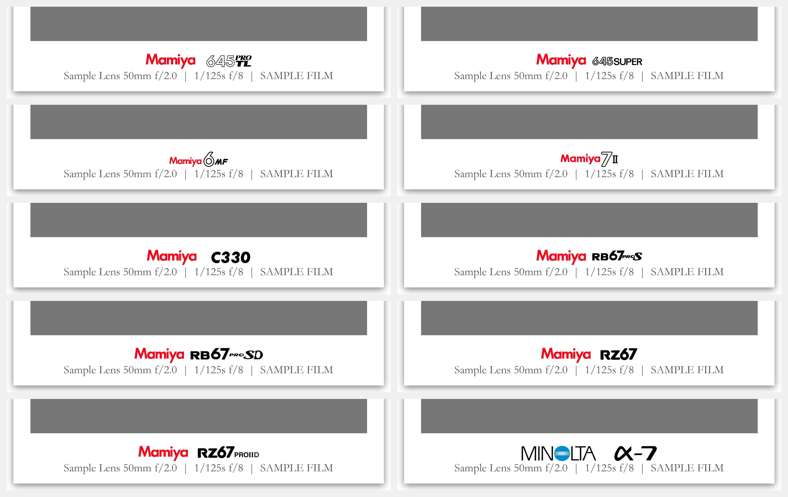 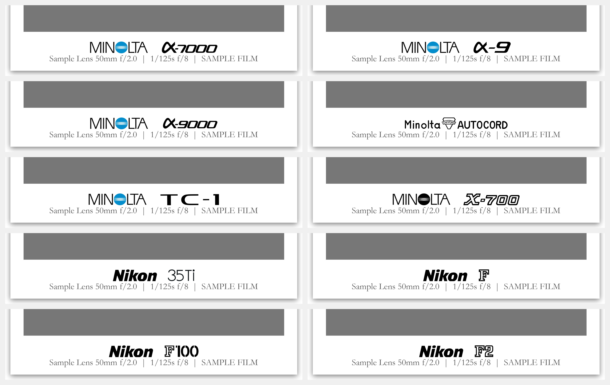
  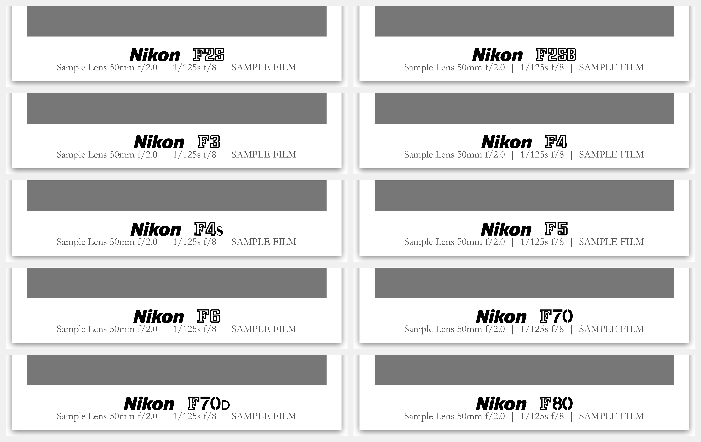 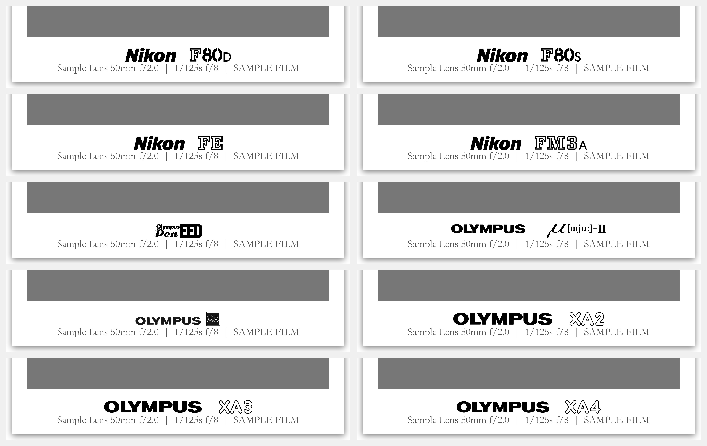
  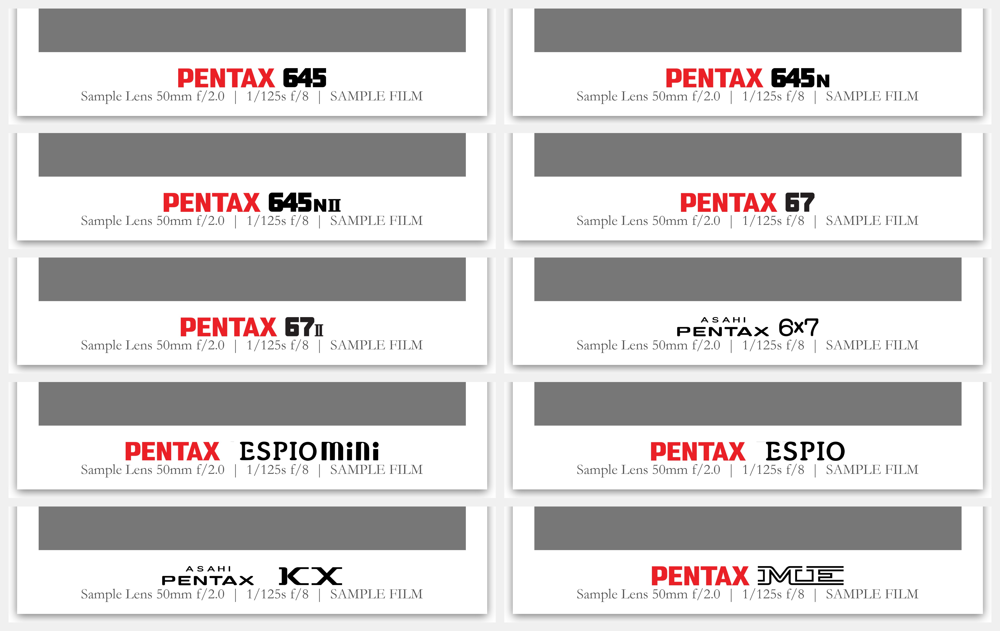 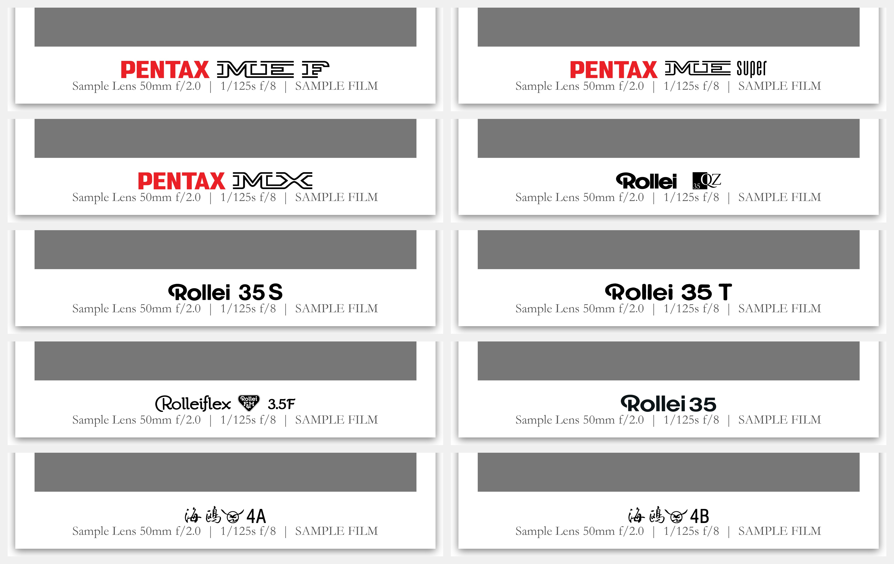
  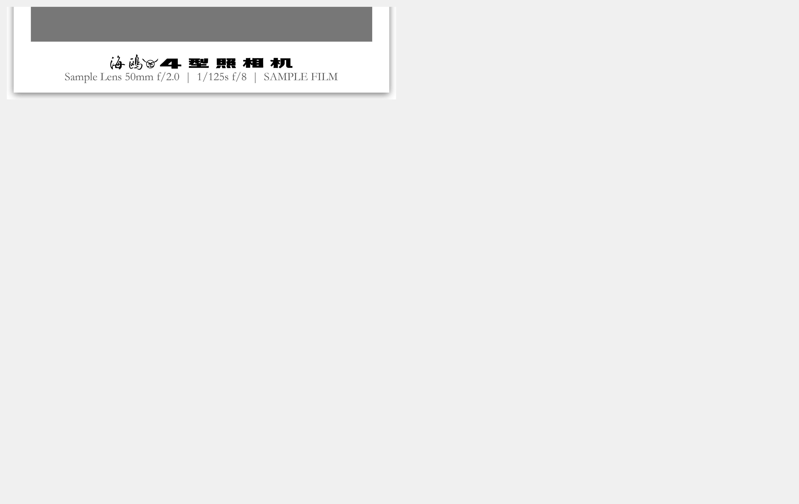

---

## 📸 Sample Outputs | 示例输出

### 🎞️ Format Library | 画幅索引示例
<table>
<tr>
<td width="50%" align="center"><b>135 Format</b> (36 frames) </td>
<td width="50%" align="center"><b>135HF (Half-Frame)</b> (72 frames) 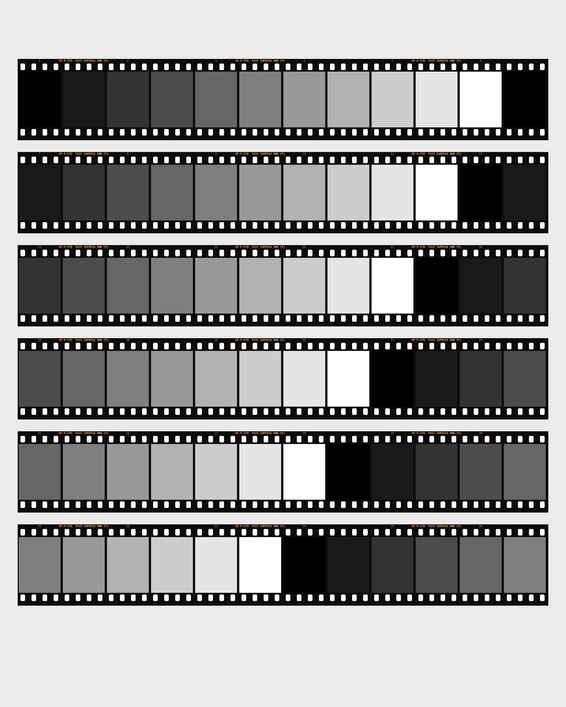</td>
</tr>
<tr>
<td width="50%" align="center"><b>66 Format</b> (12 frames) </td>
<td width="50%" align="center"><b>645 Landscape</b> (16 frames) </td>
</tr>
<tr>
<td width="50%" align="center"><b>645 Portrait</b> (16 frames) </td>
<td width="50%" align="center"><b>67 Format</b> (10 frames) </td>
</tr>
</table>

### 🔍 Detail Examples | 细节示例
<table>
<tr>
<td width="50%" align="center"><b>135 Movie Perforation | 电影卷齿孔</b> 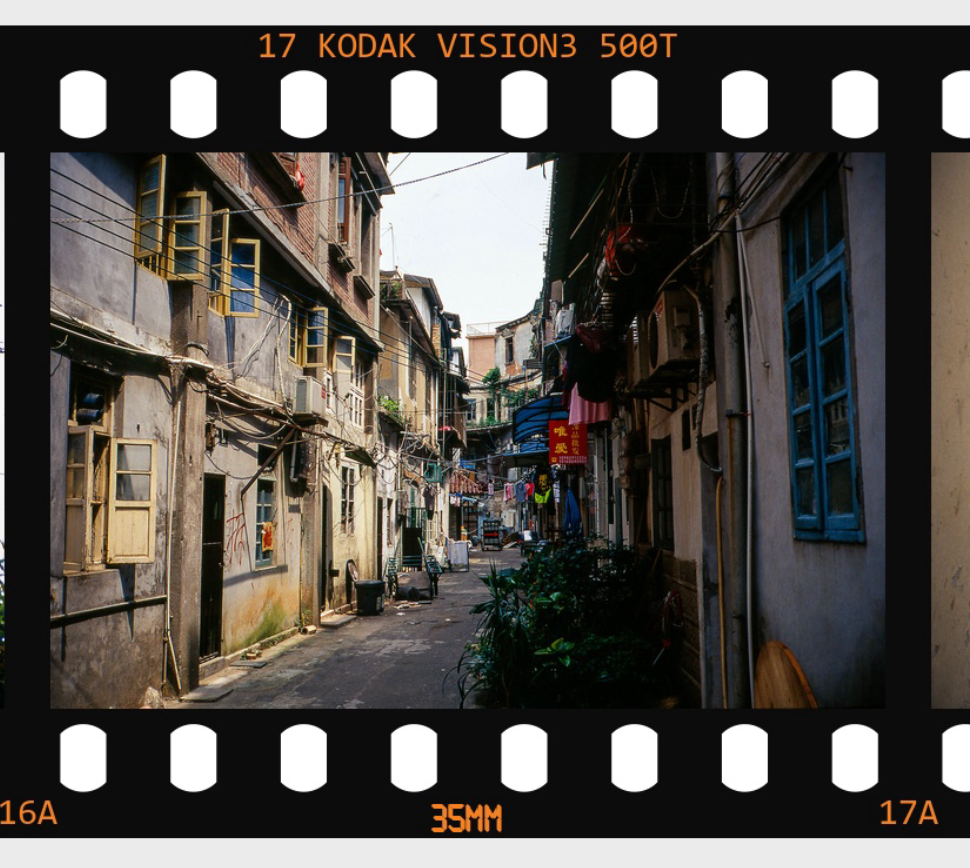</td>
<td width="50%" align="center"><b>135 Standard | 标准齿孔</b> 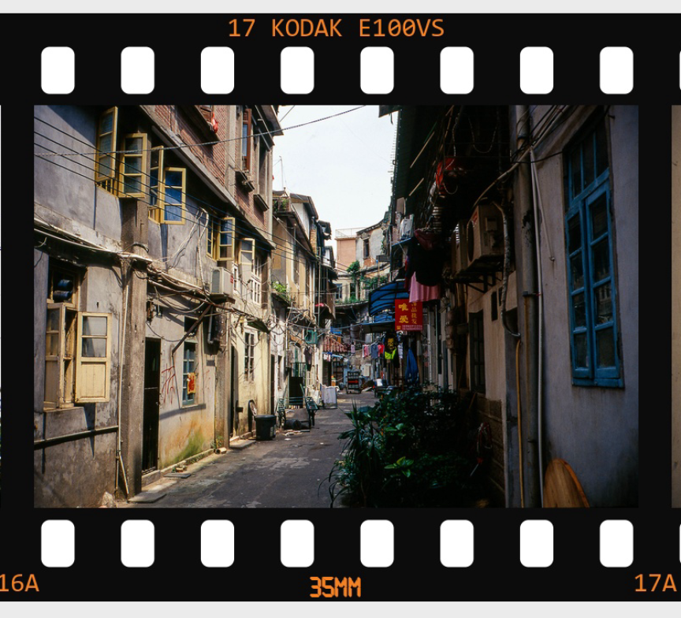</td>
</tr>
<tr>
<td colspan="2" align="center"><b>66 Border Example | 66 边框示例</b> </td>
</tr>
</table>

---

## 📦 Installation | 安装指南

1. **Download**: 获取最新的 `.exe` 独立运行程序。
2. **One-Click Sync**: 首次运行点击**“是/Yes”**，自动同步图标与胶片资产库。
3. **Usage**: 照片放入 `photos_in/`，处理结果在 `photos_out/`。

---

## 🗺️ Roadmap | 路线图
- [x] **v2.3.x**: 135HF Specialization, Artistic Themes, 121+ Logo Museum.
- [ ] **v2.4.x**: Android version full feature sync, Multi-Roll Merge support.
- [ ] **v3.0.0**: AI-enhanced film grain simulation.

---

## 🏛️ About the Name | 项目名称由来
"GT23" 致敬了 **Contax G2** 和 **T3**。它们曾定义了我的摄影之路，而这款工具旨在让那份对经典硬件的敬畏心在数字世界得以延续。

---

## 📝 License | 许可证
MIT License - See [LICENSE](LICENSE) for details.

---
*Stay analog in a digital world. 🎞️📸*