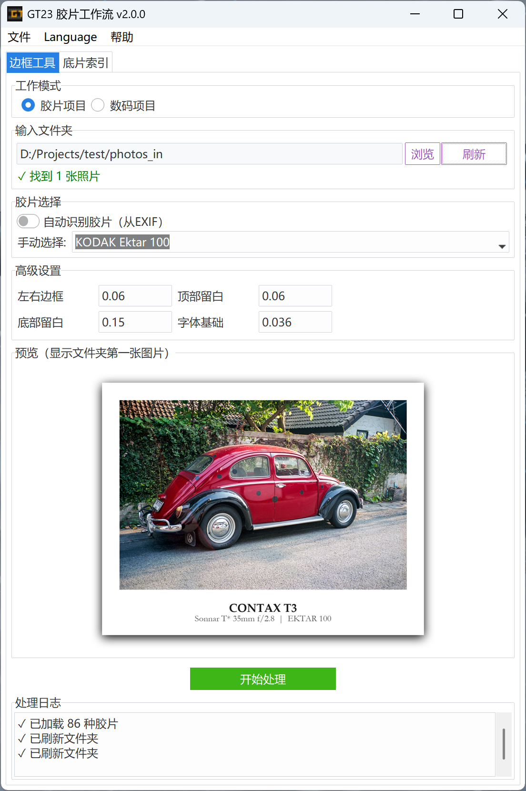
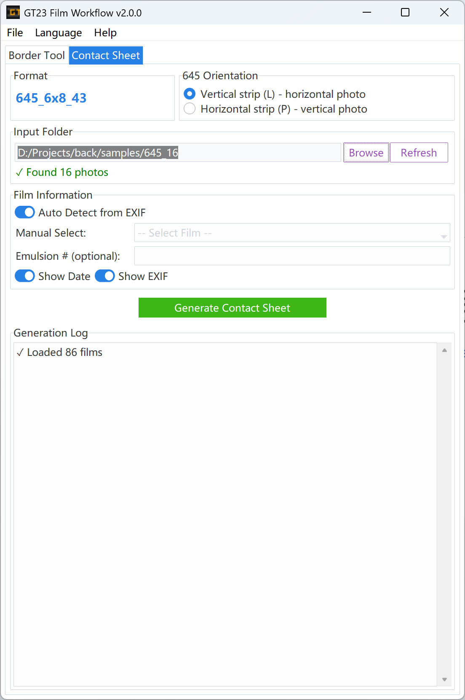

# GT23 Film Workflow (v2.3.0)

---

### 🎞️ Documentation / 项目文档

**GT23 Film Workflow** is a professional automation suite designed for film photographers. It bridges the gap between analog scans and digital presentation by simulating physical film aesthetic logic, restoring shooting metadata (EXIF) onto glowing "DataBacks", and generating industrial-grade contact sheets.
/ **GT23 Film Workflow** 是一款专为胶片摄影师打造的专业自动化工具。它旨在打破扫描件与数字展示之间的隔阂：通过模拟真实的物理底片排版逻辑，将拍摄元数据（EXIF）以“数码背印”形式还原至画面，并提供工业级的底片索引（Contact Sheet）生成能力。

---

## ✨ Featured in v2.3.x / 新特性

### 🎞️ 135HF Half-Frame Specialization / 135 半格专题
- **P/L Layouts**: Supports native vertical (9x8) and horizontal (12x6) half-frame orientations. / **双向排版**：针对半格相机的构图优化，支持 9*8(P) 或 12*6(L) 的逻辑布局。
- **Fixed 72-Slot Grid**: Fills missing frames with film-base colors for a professional full-sheet aesthetic. / **强制 72 画幅补全**：不足的部分自动以底片基色填充，保持索引印样的完整视觉。

### 🌈 Artistic Themes / 艺术边框相纸
- **Rainbow & Macaron**: Narrative-driven sequential coloring for social media grids. / **彩虹与马卡龙**：为社交媒体九宫格设计的叙事性色彩分配方案。
- **Dark Border**: Professional cold-midnight aesthetic for cinematic presentation. / **深色模式**：高对比度的冷色调排版，赋予照片工业电影质感。

---

## 🖼️ GUI Preview / 界面预览

<table>
  <tr>
    <td align="center">
      <strong>Border Tool / 边框工具</strong> 
      
    </td>
    <td align="center">
      <strong>Contact Sheet / 底片索引</strong> 
      
    </td>
  </tr>
</table>

---

## 🚀 Key Features / 核心功能

* **Dual Toolsets / 双重工具集**: 
    * **Border Tool**: Professional processing for individual scans with real-time preview and EXIF toggle. / **边框美化工具**：为单张扫描件提供专业的裁剪、填充及美化，支持实时预览。
    * **Contact Sheet**: Automated industrial-grade index sheet generation. / **底片索引工具**：自动化生成具备物理底片质感的印像页。

* **Dynamic DataBack / 动态背印**:
    * Automatically reads EXIF and renders glowing orange LED fonts. / 自动读取 EXIF 参数，采用仿真 LED 橙色数码管字体呈现背景标印。

* **Museum of Logos (160+) / 手工图标博物馆**:
    - Expanded to **160+ logos** meticulously traced from original vintage documentation. / 跨越式更新至 **160+** 款，每一格图标均来自相机原始时代的纸质文献。

  

---

## 📦 Installation / 安装指南

1. **Download**: Get the latest `.exe` package. / **下载**：获取最新的 `.exe` 独立运行程序。
2. **Sync**: First run to sync icon and film stock library. / **同步**：首次运行点击“是/Yes”，自动同步图标与胶片资产库。
3. **Usage**: Put photos in `photos_in/`, get results in `photos_out/`. / **使用**：照片放入 `photos_in/`，处理结果在 `photos_out/`。

---

## 🗺️ Roadmap / 路线图
- [x] **v2.3.x**: 135HF, Artistic Themes, 160+ Logos. / **v2.3.x**：135HF 专业化、艺术主题、160+ 客制图标。
- [ ] **v2.4.x**: Android version full feature sync. / **v2.4.x**：安卓版全功能同步。

---

## 🏛️ About the Name / 项目名称由来

"GT23" is a homage to two legendary Contax compact cameras that defined my journey in photography: the **Contax G2** and **T3**. This tool is built to keep that spirit of reverential respect for classic hardware alive in the digital age.

/ “GT23”致敬了定义我的摄影之路的两款经典紧凑相机：**Contax G2** 与 **T3**。这款工具旨在让那份对经典硬件的敬畏之心在数字时代得以延续。

---

## ⚖️ License / 许可证
MIT License - See [LICENSE](LICENSE) for details. / MIT 许可证 - 详见 LICENSE 文件。

---
*Stay analog in a digital world. 🎞️📸*
