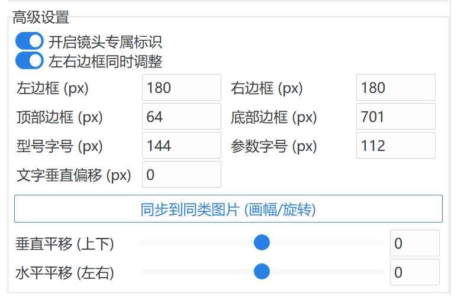

# GT23 Film Workflow (v2.4.0)

---

### 🎞️ Documentation / 项目文档

**GT23 Film Workflow** is a professional automation suite designed for film photographers. It bridges the gap between analog scans and digital presentation by simulating physical film aesthetic logic, restoring shooting metadata (EXIF) onto glowing "DataBacks", and generating industrial-grade contact sheets.
/ **GT23 Film Workflow** 是一款专为胶片摄影师打造的专业自动化工具。它旨在打破扫描件与数字展示之间的隔阂：通过模拟真实的物理底片排版逻辑，将拍摄元数据（EXIF）以“数码背印”形式还原至画面，并提供工业级的底片索引（Contact Sheet）生成能力。

---

## ✨ Featured in v2.4.0 / 新特性

### 🎨 Slate Teal Theme / 石板青主题
- **Industrial Aesthetic**: Introducing an exclusive deep teal palette with Gamma 1.6 optical simulation. / **工业级质感**：全新的“石板青”方案，具备 Gamma 1.6 光学仿真特性与结构化漫反射投影模型。
- **Frosted Glass Blur**: Dynamic blur effect that automatically adapts text color for readability. / **磨砂玻璃虚化**：新增动态背景虚化边框，支持根据亮度自动切换文字黑白逻辑。

### 📸 Precision Composition / 像素级控制
- **Pixel-level Control**: Margins changed from ratios to exact pixels for ultimate precision. / **像素级微调**：边距单位全面转为像素，支持照片在画框内的双轴精细平移与重心调整。
- **Radar v2 Safety**: Real-time overflow detection and photo-text collision alerts. / **安全预警系统**：实时监测元数据溢出与碰撞，确保每一张作品的构图完美。

---

## 🖼️ GUI Preview / 界面预览

<table>
  <tr>
    <td align="center">
      <strong>Border Controller / 构图控制</strong> 
      
    </td>
    <td align="center">
      <strong>Multi-aspect Adaptive / 画幅自适应</strong> 
      
    </td>
  </tr>
</table>

---

## 🚀 Key Features / 核心功能

* **Dual Toolsets / 双重工具集**: 
    * **Border Tool**: Professional processing for individual scans with real-time preview and EXIF toggle. / **边框美化工具**：为单张扫描件提供专业的裁剪、填充及美化，支持实时预览。
    * **Contact Sheet**: Automated industrial-grade index sheet generation. / **底片索引工具**：自动化生成具备物理底片质感的印像页。

* **Dynamic DataBack / 动态背印**:
    * Automatically reads EXIF and renders glowing orange LED fonts. / 自动读取 EXIF 参数，采用仿真 LED 橙色数码管字体呈现背景标印。

* **Museum of Logos (160+) / 手工图标博物馆**:
    - Expanded to **160+ logos** meticulously traced from original vintage documentation. / 跨越式更新至 **160+** 款，每一格图标均来自相机原始时代的纸质文献。

  

---

## 📦 Installation / 安装指南

1. **Download**: Get the latest `.exe` package. / **下载**：获取最新的 `.exe` 独立运行程序。
2. **Sync**: First run to sync icon and film stock library. / **同步**：首次运行点击“是/Yes”，自动同步图标与胶片资产库。
3. **Usage**: Put photos in `photos_in/`, get results in `photos_out/`. / **使用**：照片放入 `photos_in/`，处理结果在 `photos_out/`。

---

## 🗺️ Roadmap / 路线图
- [x] **v2.4.x**: Slate Teal Theme, Pixel-level Precision, Radar v2. / **v2.4.x**：石板青主题、像素级精度、Radar v2 安全系统。
- [ ] **v2.5.x**: Global Plugin System & Performance Optimization. / **v2.5.x**：全局插件化系统、运行性能极限优化。

---

## 🏛️ About the Name / 项目名称由来

The project name "GT23" is a homage to two legendary Contax compact cameras that profoundly influenced my journey in film photography: the **G2** and **T3**. They were once my cherished possessions, but were eventually parted with due to circumstance. Since then, their prices have soared beyond reach, making a reunion a distant hope. The memories captured with these two outstanding cameras remains vivid, and when I set out to develop a film photography tool, honoring them by name was the only fitting choice.

/ 项目名称 "GT23" 致敬了影响我胶片摄影之路的两部 Contax 传奇紧凑型相机：**G2** 和 **T3**。它们曾是我的珍藏，但因缘际会最终出手。此后价格飙升，再也难以企及，重逢无望。用这两部杰出相机拍摄的记忆依然鲜活，当我着手开发一款胶片摄影工具时，用它们的名字致敬，是唯一合适的选择。

---

## ⚖️ License / 许可证
MIT License - See [LICENSE](LICENSE) for details. / MIT 许可证 - 详见 LICENSE 文件。

---
*Stay analog in a digital world. 🎞️📸*
