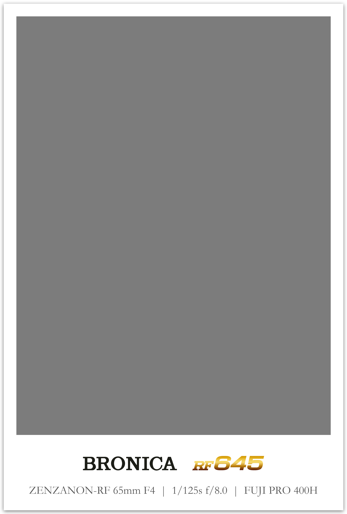

# GT23 Film Workflow (v2.3.0)

### [English] | [中文]

**GT23 Film Workflow** is a professional automation suite designed for film photographers. It bridges the gap between analog scans and digital presentation by simulating physical film aesthetic logic, restoring shooting metadata (EXIF) onto glowing "DataBacks", and generating industrial-grade contact sheets.

**GT23 Film Workflow** 是一款专为胶片摄影师打造的专业自动化工具。它旨在打破扫描件与数字展示之间的隔阂：通过模拟真实的物理底片排版逻辑，将拍摄元数据（EXIF）以“数码背印”形式还原至画面，并提供工业级的底片索引（Contact Sheet）生成能力。

---

## 🌟 Core Twin-Engines | 核心双引擎

GT23 由两大核心功能模块驱动，旨在覆盖从单张精修到整卷归档的全流程：

### 1. Border Tool | 专业边框工具
EN: A precision tool for individual scan processing. Features non-destructive center-cropping, customizable border ratios, and dynamic metadata overlay. 
CN: 针对单张扫描件的精密处理工具。支持无损居中裁切、自定义边框比例，以及动态元数据层级化展示。

### 2. Contact Sheet Tool | 底片索引工具
EN: Automated physical film strip simulation. Supports standard 135, 120 (645/66/67), and the brand-new **135HF (Half-Frame)** formats.
CN: 自动化的物理底片条模拟工具。支持标准 135、120（645/66/67）以及全新的 **135HF（半格）** 索引排版。

---

## 🔥 Featured in v2.3.0 | 新版本特性

### 🎞️ 135HF Half-Frame Specialization | 135 半格专项支持
- **Native Portrait/Landscape**: Optimized layouts for vertical (9x8) and horizontal (12x6) half-frame orientations.
- **Fixed 72-Slot Grid**: Automatically fills missing frames with film-base colors to maintain a professional full-sheet aesthetic.
- **原生横/纵排版**：针对半格相机的原生构图优化，支持 9*8 或 12*6 的逻辑布局。
- **强制 72 画幅补全**：不足一卷的照片将自动以底片基色填充槽位，保持专业印样的完整视觉感。

  

### 🌈 Artistic Boundary System | 全新艺术边框系统
- **Rainbow & Macaron Themes**: Narrative-driven sequential coloring for social media "Grids".
- **Dark Border Mode**: Professional cold-midnight aesthetic with high-contrast typography.
- **彩虹与马卡龙主题**：为社交媒体九宫格设计的叙事性色彩分配方案，支持长卷渐变与随机配色。
- **专业深色模式**：深邃的冷色调背景配合高对比度排版，赋予照片工业电影质感。

---

## 🏛️ Museum of Logos | 图标博物馆 (121+ Models)

EN: **Authenticity First**. Every single logo in GT23 is manually traced from **original vintage documentation** and service manuals (Mamiya, Rollei, Contax, Hasselblad, etc.). We don't just use icons; we preserve the soul of the equipment.

CN: **极致还原，拒绝平替**。GT23 内置的 121+ 款图标均由开发者一人**从数十年历史的原始纸质说明书与宣传册中手工勾勒还原**。我们不使用通用字体，只保留每一款型号最纯正的工业设计灵魂。

  

---

## 🖼️ Visual Showcase | 视觉展示

### 🎞️ Format Library | 画幅库
<table>
  <tr>
    <td align="center"><strong>135 Standard (36 Exp)</strong> </td>
    <td align="center"><strong>66 Square (12 Exp)</strong> </td>
  </tr>
  <tr>
    <td align="center"><strong>645 Landscape/Portrait</strong>  </td>
    <td align="center"><strong>67 Ideal Format (10 Exp)</strong> </td>
  </tr>
</table>

### 🔍 Precision Details | 精度细节
<table>
  <tr>
    <td align="center"><strong>Digital DataBack (LED Font)</strong> </td>
    <td align="center"><strong>Pro Border Layout (66)</strong> </td>
  </tr>
</table>

---

## 🚀 Quick Start | 快速上手

### EXE Users (Recommended) | 独立版用户（推荐）
1. **Download**: Grab `GT23_Workflow_v2.3.0.exe` from [Releases](https://github.com/hugoxxxx/GT23_Workflow/releases).
2. **Launch & Sync**: Double-click to run. On the first launch, click **"Yes"** to automatically download the 121+ logos and film profiles into the `GT23_Assets/` folder.
3. **Process**: Put your scans in `photos_in/`, adjust settings in GUI, and find results in `photos_out/`.

1. **下载**: 从 [Releases](https://github.com/hugoxxxx/GT23_Workflow/releases) 获取 `GT23_Workflow_v2.3.0.exe`。
2. **启动与同步**: 双击启动。首次运行时点击**“是”**，程序会自动将 121+ 款图标与胶片库拉取至同级的 `GT23_Assets/` 目录。
3. **使用**: 将照片放入 `photos_in/`，在界面调整参数，处理结果将出现在 `photos_out/`。

---

## 🏛️ About the Name | 项目名称由来

**EN**: The name "GT23" pays homage to the **Contax G2** and **T3**. These cameras shaped my film journey but are now far beyond financial reach. This tool is my tribute to the memories they created.
**CN**: "GT23" 致敬了 **Contax G2** 和 **T3**。它们曾定义了我的摄影之路，虽因价格高昂重落凡尘，但通过这款工具，我让那份快感以数字形式得以延续。

---

## 🗺️ Roadmap | 路线图
- [x] **v2.3.x**: 135HF Specialization, Artistic Themes, 121+ Logo Museum.
- [ ] **v2.4.x**: Android version full feature sync, Multi-Roll Merge support.
- [ ] **v3.0.0**: AI-enhanced film grain simulation, Cloud asset sharing.

---

## 📝 License | 许可证
MIT License - See [LICENSE](LICENSE) for details.

---
*Stay analog in a digital world. 🎞️📸*