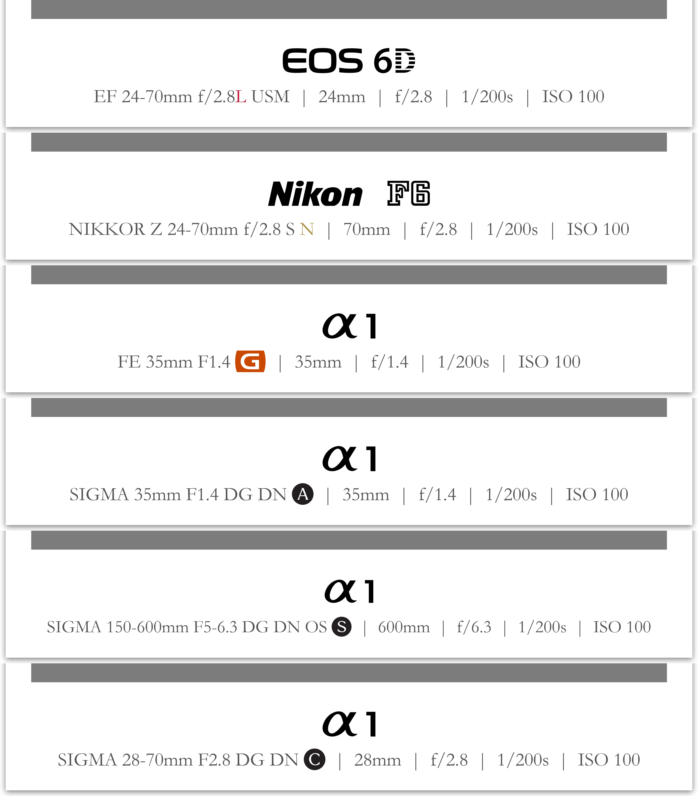
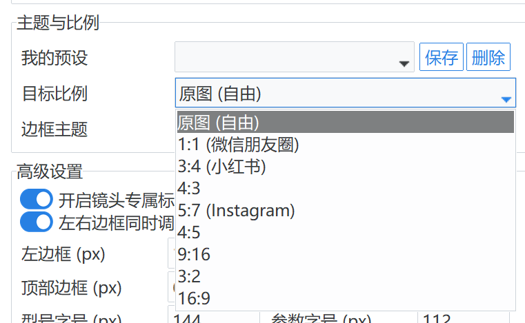

# GT23 Workflow v2.4.0 版本发布说明

感谢各位摄影师的支持，v2.4.0 版本现已正式发布。本次更新主要聚焦于提升构图精度、丰富审美选择以及加强系统操作的稳定性。以下是本次更新的主要内容：

## 🎨 视觉审美更新

- **石板青 (Slate Teal) 主题**：本次 2.4.0 引入了极具工业质感的专属主题。新主题支持 Gamma 1.6 光学仿真，背景具备更开阔的“呼吸感”，并配备了三层结构化漫反射投影模型，让照片呈现自然悬浮的视觉效果。
- **磨砂玻璃 (Frosted Glass) 边框**：新增磨砂虚化背景效果。由图片虚化后的渐变与颗粒纹理组成，背景过渡细腻，并能根据背景亮度自动切换文字颜色（黑/白），确保元数据清晰可读。

### 石板青 3:4 渲染效果

### 磨砂玻璃 1:1 渲染效果

- **品牌专属勋章设计**：针对旗舰镜头引入了专属视觉风格。可自动识别佳能 L (红)、尼康 N (金)、以及索尼 GM、适马 A/S/C 等勋章，并在“高级设置”中支持全局开关。

## 📸 像素级精准控制

- **从“比例”到“像素”**：边框宽度单位全面切换为像素控制。用户可以直接输入精确的像素值，实现真正的原子级微调。
- **双轴构图平移**：支持照片在画框内的水平与垂直双轴独立位移。用户可以通过数值或滑块精细调整照片重心。
- **安全预警系统 (Radar v2)**：实时监测文字是否水平溢出或与照片发生垂直碰撞，并提供字号调整参考建议。

## ⚡ 生产力飞跃

- **审美预设系统**：一键保存当前所有的边框参数、比例和字体设置。
- **社交媒体比例自适应**：预设了 1:1 (微信)、3:4 (小红书)、5:7 (Instagram) 等分享比例。
- **一键同步同类图片**：同步当前的所有审美配置到批次中同画幅的所有照片。

## 🏗️ 架构加固

- **代码深度重构**：核心控制逻辑离岸化，显著减少内存占用并提升响应速度。
- **路径归一化**：解决所有 Windows 下的配置读取兼容性问题。

感谢各位创作者的贡献，让我们一起在“石板青”中记录光影。
