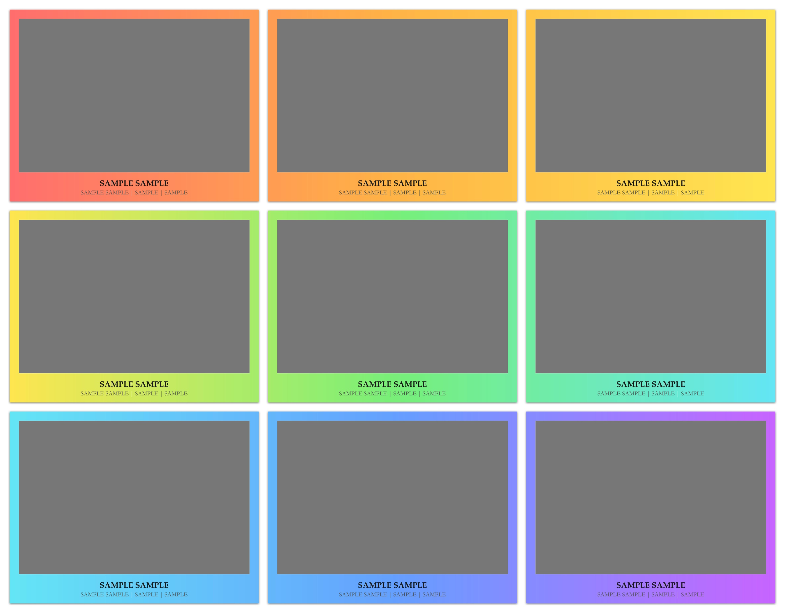

# GT23 Film Workflow v2.3.0 发布说明

## 🚀 重磅更新：全新边框样式与社交分享增强

在 v2.3.0 版本中，我们为您带来了 **3 款** 全新边框主题，并针对社交媒体分享场景进行了深度审美优化。

### 1. 🌈 彩虹相纸 (Rainbow Theme)
灵感源自经典的富士胶片（Fujifilm Instax）彩虹渐变相纸。
- **连续光谱**: 在批量处理多张图片时，系统会自动分配光谱顺序。当您将成品图连拼时，会呈现出一条丝滑、无断点的彩虹渐变长卷。
- **视觉美感**: 独特的色彩过渡算法，为您的扫街或日常记录增添一份梦幻感。

*彩虹相纸：九宫格连续渐变效果展示。*

### 2. 🍭 马卡龙色系 (Macaron Palette)
全新设计的马卡龙渐变底色，专为追求个性化审美的用户打造。
- **九色连辉**: 提供了 9 种精选的动态渐变色。当您选择“马卡龙”主题并进行批量处理时，系统会根据图片在列表中的位置分配不同的固定配色组合，确保九宫格展示时色彩丰富且各不相同。
- **稳定算法**: 我们引入了基于位置的确定性色彩分配，确保您重启预览或重新排序时，每张图获得的配色方案始终如一。

*马卡龙配色：专为朋友圈九宫格打造的梦幻渐变。*

### 3. 🌑 专业深色边框 (Professional Dark Border)
针对高亮度、高对比度的作品，我们推出了全新的专业深色边框。
- **极致深邃**: 背景采用深度调准的炭黑色，完美衬托画面主体。
- **白墨增强**: 针对深色背景，系统会自动对 Logo 和文字进行反色处理，并应用高精度的边缘优化算法，确保信息清晰且具备质感。

*深色边框：更适合极简主义或高调影像作品。*

### 4. 🧠 智能配置记忆 (Per-Image State)
这是一个显著提升操作便利性的新特性。
- **单图记忆**: 现在，每一张导入的照片都会“记住”属于它自己的配置。
- **个性化显隐**: 如果您觉得样片 A 适合显示 Logo，而样片 B 适合“纯净模式”，系统会在您切换图片时自动恢复之前的偏好设置，无需反复勾选。

---
## 🛠️ 下一阶段计划
- [ ] **接触印相 (Contact Sheet)**：我们将启动 **“半格索引” (Half-Frame)** 模式的硬核开发。

---
*Stay analog in a digital world. 🎞️📸*
